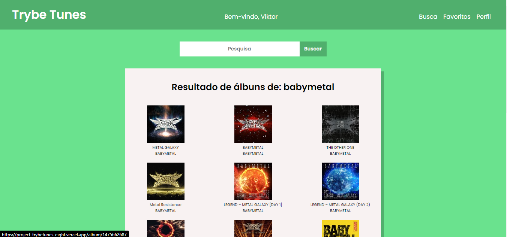

# Project Trybetunes :musical_note:

Projeto desenvolvido durante o módulo de Front-end do curso de desenvolvimento web na Trybe.

## Sobre o projeto

Neste projeto desenvolvi uma aplicação para pesquisar e listar álbuns e músicas de várias bandas e artistas. Você pode conferirir esta aplicação funcionando [neste link](https://project-trybetunes-eight.vercel.app/).

Nesta aplicação é possível:
   - Pesquisar e listar álbuns e músicas de várias bandas e artistas.
   - Ouvir o preview de cada música.
   - Favoritar suas músicas preferidas.

## Imagens do projeto

## Rodando o projeto

1. Clone o repositório
   - Use o comando: `git clone git@github.com:rayandersonsousa/project-trybetunes.git`
   - Entre na pasta do projeto: `cd project-trybetunes`
2. Instale as dependências do projeto
   - `npm install`
3. Rode a aplicação no seu navegador
   - `npm start`

## Tecnologias aplicadas

- React
- JavaScript
- HTML
- CSS
- React Router
- Lifecycle-methods

## Skills aplicadas

- Desenvolver uma página para listar álbuns e músicas de vários artistas e bandas.
- Desenvolver uma função para pesquisar músicas e álbuns.
- Desenvolver uma página para ouvir o preview das músicas.
